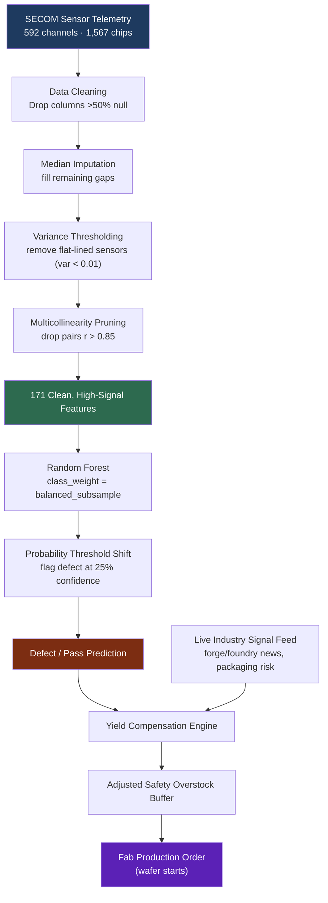
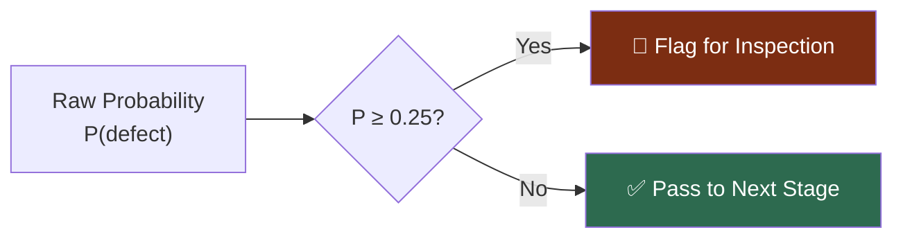
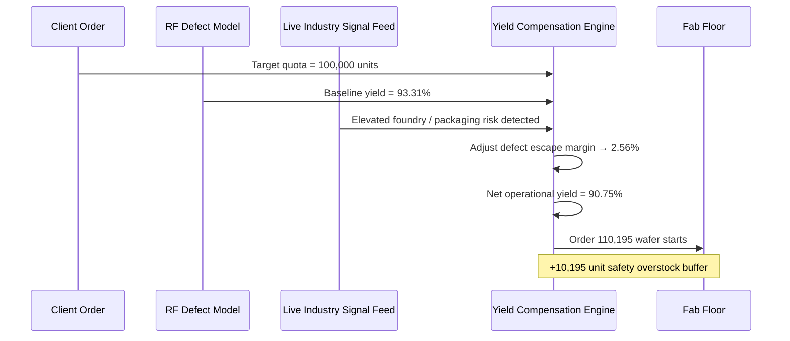

# Semiconductor Chip Defect Detection
Machine learning-based detection of semiconductor chip defects using manufacturing process measurements.

**An end-to-end machine learning system that catches defective chips before they leave the fab — and translates that prediction directly into an actionable, real-time production order.**

This project was built to solve a problem every fab engineering team faces: standard classifiers are statistically lazy. Given a dataset where 93%+ of chips pass, a naive model achieves "high accuracy" by never flagging a defect at all — a silent catastrophe in a manufacturing environment where an undetected fault escapes to the customer. This pipeline was engineered specifically to break that failure mode, and then extended into a live decision-support system that connects model output to fab floor production quotas.

---

## Why This Matters to a Fab

| Business Risk | Engineering Response |
|---|---|
| Naive models miss 100% of defects at "high accuracy" | Rebuilt the objective around **recall on the failure class**, not raw accuracy |
| 592 noisy sensor channels, heavy missingness | Built a disciplined feature-reduction pipeline down to 171 high-signal features |
| Static yield formulas don't react to real-world volatility | Built a **dynamic buffer engine** that adjusts wafer starts using live industry signals |
| Fixed classification thresholds under-catch rare failures | Re-tuned the decision boundary specifically for asymmetric cost of errors |

---

## System Architecture



---

## The Core Challenge: Extreme Class Imbalance

The raw dataset skews heavily toward passing chips, which sinks naive classifiers before they even start:


A model that always predicts "Pass" scores **93.4% accuracy** and **0% recall** — every single defective chip ships. This is the exact failure mode the pipeline was designed to eliminate.

---

## Engineering the Fix: Two-Pronged Imbalance Strategy

1. **Balanced Sample Weighting** — the `RandomForestClassifier` is initialized with `class_weight="balanced_subsample"`, forcing every individual tree to penalize missed defects far more heavily than missed passes during training.
2. **Probability Threshold Shifting** — rather than the default 50% decision boundary, the model's raw `.predict_proba()` output is thresholded at **25%**. Any chip the model is even modestly suspicious of gets flagged for manual re-inspection — trading a manageable rise in false alarms for a sharp drop in undetected failures.



---

## Model Performance

| Model | Pass-Class Precision | **Defect Recall** | Overall Accuracy |
|---|:---:|:---:|:---:|
| Logistic Regression (baseline) | 93% | 33% | 80% |
| Support Vector Machine (RBF) | 94% | 10% | 93% |
| **Optimized Random Forest (final)** | **97%** | **67%** | 78% |

The headline number here isn't accuracy — it's the **6.7x improvement in defect recall** over the SVM baseline. In a fab context, that's the difference between catching 1 in 10 bad chips and catching 2 in 3, at the cost of a deliberately accepted, modest dip in raw accuracy — the correct trade-off when a false negative is far more expensive than a false positive.

### Final Confusion Matrix (Held-Out Test Set)

| | Predicted Pass (-1) | Predicted Defect (1) |
|---|:---:|:---:|
| **Actual Pass** | 230 | 63 |
| **Actual Defect** | 7 | 14 |

---

## From Prediction to Production: The Yield Compensation Engine

A recall score alone doesn't run a fab — engineers need to know how many wafers to actually start. This system closes that loop by feeding live model performance and real-time industry risk signals directly into a dynamic overstock calculator, replacing static, spreadsheet-driven yield buffers.



**Factory Compensation Report — sample live output:**

```
Target Quota Ordered by Client:    100,000 units
Baseline Fabricator Pure Yield:    93.31%
Adjusted Defect Escape Margin:     2.56%  (news-adjusted)
Calculated Operational Net Yield:  90.75%
------------------------------------------------------------
PRODUCTION ORDER TO FAB:           110,195 wafer starts
Required Safety Overstock Buffer:   10,195 units
```

When headlines signal foundry disruption or sub-3nm packaging complications, the buffer automatically widens — production planning reacts to the world in near real time instead of waiting on a quarterly yield review.

---

## Skills Demonstrated

- **Imbalanced classification** — cost-sensitive learning, threshold tuning, precision/recall trade-off analysis on a real industrial dataset
- **Feature engineering at scale** — reducing 592 noisy sensor channels to 171 high-signal features via null filtering, imputation, variance thresholding, and multicollinearity pruning
- **Applied statistics for manufacturing** — translating model recall/precision directly into yield and overstock calculations that map to real production costs
- **Systems integration** — combining a trained model with a live external data feed (NewsAPI) into a single automated decision pipeline
- **Manufacturing domain fluency** — framing every modeling decision (threshold, class weighting) around the actual cost asymmetry of a defect escape vs. a false alarm on the fab floor

---

*Dataset: UCI SECOM Semiconductor Manufacturing dataset. Pipeline implemented in Python (scikit-learn, pandas), with a production-integration layer connecting model output to a live news-driven yield buffer calculator.*


### Built for precise manufacturing systems by Yaswitha Nandu Yalamanchali
